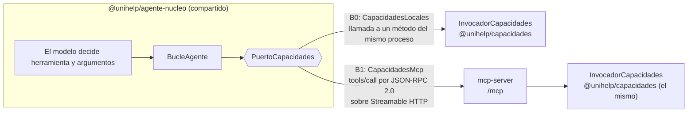
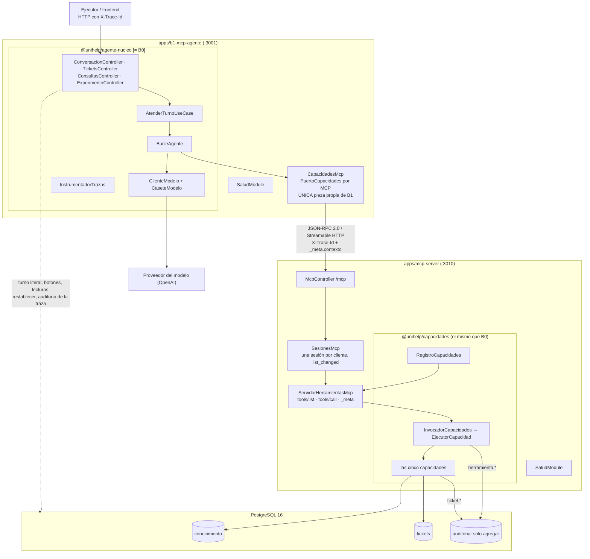

# Arquitectura de B1: agente único sobre servidor MCP

> Estado: **implementado** en su primera versión (23 de septiembre de 2026). B1 responde el
> mismo contrato que B0 por las rutas de `libs/contratos`, el frontend lo usa con
> `?backend=http://localhost:3001` y el ejecutor con `backends.B1` de
> `experiment/ejecutor/corrida.yaml`. La tarea compuesta T-COM-001 recorre las cinco
> herramientas por MCP de punta a punta (prueba `nx e2e b1-mcp-agente`). Pendiente: correr
> en Docker (igual que B0), la prueba de sustitución B0/B1 en `replay` y las decisiones de la
> [sección 13](#13-decisiones-pendientes).

Este documento sigue la estructura de
[`apps/b0-directo/docs/ARQUITECTURA.md`](../../b0-directo/docs/ARQUITECTURA.md) y **solo
desarrolla lo que difiere de B0**. Todo lo que no se menciona aquí (bucle, cliente del modelo,
casetes, presupuesto, extractor del objeto final, capa de conversación, defensa ante inyección,
reglas de instrumentación) es **el mismo código**, que vive en
[`libs/agente-nucleo`](../../../libs/agente-nucleo/README.md) y se describe en el documento de
B0. Donde el encargo, el anexo y el repositorio no coinciden, no se elige: la diferencia queda en
la sección 13 (RM-17).

## Cómo leer las marcas

| Marca          | Significa                                                                       |
| -------------- | ------------------------------------------------------------------------------- |
| **[existe]**   | Está en el repositorio hoy, en la ruta indicada.                                |
| **[DP-B1-nn]** | Depende de una decisión pendiente de la sección 13. Lo escrito es la propuesta. |
| **[= B0]**     | Idéntico a B0: mismo archivo, sin ninguna rama condicional por arquitectura.    |

## 1. Qué es B1

B1 es el **mismo agente único** de B0 cuyas cinco capacidades se alcanzan como herramientas de
un **servidor MCP independiente** (`apps/mcp-server`, puerto 3010) en vez de como clases del
mismo proceso (`CATALOGO_ARQUITECTURAS.B1` en
[`libs/dominio`](../../../libs/dominio/src/lib/arquitecturas.ts) **[existe]**). Es el minuendo
del contraste de H1: `P(B1) − P(B0)` (docs/09 §14) solo significa «lo que cuesta MCP» si las
dos arquitecturas difieren **únicamente** en el transporte de la invocación.

### Frontera exacta con B0

El nucleo del agente es una libreria compartida que depende de una interfaz de dos operaciones,
`PuertoCapacidades` (`listar()` e `invocar()`, en
[`libs/herramientas`](../../../libs/herramientas/src/lib/puerto-capacidades.ts) **[existe]**).
Cada arquitectura aporta **una** implementación:



| Aspecto                                    | B0                                                   | B1                                                                                   | ¿Puede diferir?                                          |
| ------------------------------------------ | ---------------------------------------------------- | ------------------------------------------------------------------------------------ | -------------------------------------------------------- |
| Nucleo (bucle, modelo, casetes, límites)   | `AgenteNucleoModule` **[= B0]**                      | `AgenteNucleoModule` **[= B0]**                                                      | No: es la misma librería                                 |
| Prompt base, modelo, muestreo              | `PROMPT_BASE` 1.3.0, `leerConfiguracionAgente`       | Los mismos                                                                           | No (RNF-01, RNF-08)                                      |
| Herramientas que recibe el modelo          | `DEFINICIONES_HERRAMIENTAS` vía `CapacidadesLocales` | Las que publica `tools/list`, traducidas con `descripcionDesdeHerramientaPublicada`  | No: `contrato.spec.ts` de `mcp-server` falla si divergen |
| Traducción a function calling              | `aFunctionCalling` **[= B0]**                        | `aFunctionCalling` **[= B0]**                                                        | No: un solo lugar                                        |
| Implementación de cada capacidad           | `@unihelp/capacidades`, en proceso                   | `@unihelp/capacidades`, dentro de `mcp-server`                                       | No                                                       |
| Validación, límite, saneamiento, auditoría | `EjecutorCapacidad` en el proceso de B0              | `EjecutorCapacidad` en el proceso de `mcp-server`                                    | No es otro código; **sí** otro proceso (ver §11, límite) |
| **Transporte de la invocación**            | Llamada a método                                     | `tools/call` por JSON-RPC 2.0 sobre Streamable HTTP, sesión con estado               | **Sí: es la variable que mide H1**                       |
| Descubrimiento                             | Lista fija del registro                              | `tools/list` al primer uso y tras `notifications/tools/list_changed` (HU-25, HU-27)  | Sí, es parte del protocolo                               |
| `tool_calls[].agente`, `transporte`        | `b0-directo`, `directo`                              | `b1-mcp-agente`, `mcp`                                                               | Sí, por diseño de la traza                               |
| Actor de auditoría                         | `b0-agent`                                           | `b1-agent`                                                                           | Sí, por diseño (docs/01, 4.6)                            |
| `timing.breakdown.transport_ms`            | `rtt − dur` de la llamada local                      | `rtt − dur` de cada `tools/call`, con `dur` **reportado por el servidor** en `_meta` | Sí: es lo que se quiere observar (M4.2, D5)              |
| API HTTP hacia el frontend y el ejecutor   | `RUTAS_API`, `RUTAS_EXPERIMENTO`                     | Las mismas rutas y DTO                                                               | No (regla 5 de `AGENTS.md`)                              |

## 2. Historias de usuario que responde

Las de B0 (sección 2 del documento de B0) más las propias del protocolo:

| HU    | Qué aporta B1                                                                                                                  | Dónde                                                                                                             |
| ----- | ------------------------------------------------------------------------------------------------------------------------------ | ----------------------------------------------------------------------------------------------------------------- |
| HU-25 | Las cinco herramientas con esquema de entrada y salida por `tools/list`; instantánea versionada; equivalencia con B0           | `mcp-server/src/app/mcp/servidor-herramientas-mcp.ts`, `contrato.spec.ts`, `contrato/tools-list.instantanea.json` |
| HU-26 | Anotaciones: consultas de solo lectura e idempotentes; creación destructiva                                                    | `DEFINICIONES_HERRAMIENTAS.anotaciones`, publicadas tal cual                                                      |
| HU-27 | Registro aditivo, `notifications/tools/list_changed`, el agente incorpora la herramienta sin reiniciar. La sexta sigue sellada | `RegistroCapacidades.agregar`, `SesionesMcp`, `CapacidadesMcp`                                                    |
| HU-33 | `X-Trace-Id` viaja del ejecutor al agente y del agente al servidor MCP, y llega a la auditoría                                 | `CapacidadesMcp.fetchConCabeceras`, `contextoDeLlamada`                                                               |
| HU-34 | El servidor reporta su duración; el agente calcula el transporte por resta                                                     | `aResultadoMcp` (`_meta`), `CapacidadesMcp.invocar`                                                               |
| HU-16 | La garantía del token vive en `CrearTicketUseCase`, detrás del servidor; un intento sin token vuelve `CONFIRMACION_REQUERIDA`  | `@unihelp/tickets`, sin código nuevo                                                                              |

Fuera de la corrida oficial: HU-28 (recursos y plantillas de prompt). No se exponen; no
aparecen en `tools/list` ni alteran la instantánea.

## 3. Diagrama de componentes



La flecha punteada es deliberada y se discute en **[DP-B1-01]**: el proceso de B1 accede a
PostgreSQL para todo lo que **no** son las cinco capacidades del agente, exactamente como B0.

## 4. Catálogo de clases

Solo las clases que no existen en B0. Rutas relativas a `apps/`.

#### `CapacidadesMcp` [existe]

| Campo           | Contenido                                                                                                                                                                                                 |
| --------------- | --------------------------------------------------------------------------------------------------------------------------------------------------------------------------------------------------------- |
| Archivo         | `libs/capacidades-mcp/src/lib/capacidades-mcp.ts` (`@unihelp/capacidades-mcp`; vivió en `b1-mcp-agente/src/app/capacidades-mcp/` hasta la decisión 44, que lo compartió con B2 y B3 sin cambiar su comportamiento) |
| Responsabilidad | Cumplir `PuertoCapacidades` con un cliente MCP: descubrir con `tools/list`, invocar con `tools/call`, propagar la traza, medir `rtt`, tomar `dur` del servidor y traducir `isError` a `ErrorHerramienta`. |
| Recibe          | `ConfiguracionClienteMcp` (`MCP_SERVER_URL`, rol `agente: null` en B1, nombre del cliente) y, opcionalmente, una fábrica de transporte (las pruebas usan `InMemoryTransport`).                            |
| Devuelve        | `DescripcionCapacidad[]` y `ResultadoInvocacion` (`ok`, `salida` o `error`, `durMs`, `rttMs`).                                                                                                            |
| Depende de      | `@modelcontextprotocol/sdk` (`Client`, `StreamableHTTPClientTransport`), `@unihelp/contratos` (`mcp.contrato.ts`), `@unihelp/herramientas`.                                                               |
| Sostiene        | HU-25, HU-27, HU-33, HU-34, D5, RM-05, RM-15 (`ErrorInfraestructuraMcp`).                                                                                                                                 |

Detalles que importan para las cifras:

- La conexión es perezosa y única: se abre en el primer `listar()`, se reutiliza la sesión y,
  si el servidor la cierra, la siguiente llamada reconecta. Un fallo de conexión o de protocolo
  es `ErrorInfraestructura` → 503 → `error_infraestructura` en el ejecutor (RM-15).
- La cabecera `X-Trace-Id` se agrega en un `fetch` propio que lee la traza de un
  `AsyncLocalStorage`, porque el transporte del SDK fija sus cabeceras al construirse y la traza
  cambia por invocación.
- Tras `list_changed` solo se **olvida** la lista; el nucleo la vuelve a pedir antes de la
  siguiente llamada al modelo y desde ahí usa la herramienta nueva (HU-27).
- Argumentos que no son un objeto no se envían: MCP exige un objeto en `arguments`; se devuelve
  `VALIDACION_ENTRADA` localmente **[DP-B1-04]**.

#### `ServidorHerramientasMcp` [existe]

| Campo           | Contenido                                                                                                                                                                                                            |
| --------------- | -------------------------------------------------------------------------------------------------------------------------------------------------------------------------------------------------------------------- |
| Archivo         | `mcp-server/src/app/mcp/servidor-herramientas-mcp.ts`                                                                                                                                                                |
| Responsabilidad | Construir un `Server` MCP (uno por sesión) que publique `RegistroCapacidades.definiciones` en `tools/list` y atienda `tools/call` con `InvocadorCapacidades`, midiendo la duración del manejador con reloj monótono. |
| Devuelve        | `CallToolResult`: `content[0].text` = el JSON que B0 pone en el rol de herramienta; `structuredContent`; `_meta['unihelp/duracion_ms']`, `_meta['unihelp/estructurado']` o `_meta['unihelp/error']`.                 |
| Sostiene        | HU-25, HU-26, HU-33 (`contextoDeLlamada`), HU-34, M2.6, M3.1.                                                                                                                                                        |

Se usa el `Server` de bajo nivel y no `McpServer` porque este solo acepta esquemas Zod y aquí
los JSON Schema del contrato deben publicarse tal cual (decisión 42).

#### `SesionesMcp` y `McpController` [existe]

`McpController` entrega `POST`, `GET` y `DELETE /mcp` al transporte del SDK. `SesionesMcp`
mantiene un `StreamableHTTPServerTransport` **con estado** por cliente: es lo que permite el flujo
SSE por el que se emite `notifications/tools/list_changed` a todas las sesiones cuando
`RegistroCapacidades` cambia. Una petición sin sesión que no es `initialize` responde 400 en
español; una sesión desconocida, 404.

#### `RegistroCapacidades`, `InvocadorCapacidades`, `CapacidadesLocales` [existe]

En [`libs/capacidades`](../../../libs/capacidades/README.md). B0 y `mcp-server` los usan; B1
**no** los importa: si lo hiciera, la comparación dejaría de medir el transporte.

## 5. Las herramientas

El contrato es el de la sección 5 del documento de B0 (`DEFINICIONES_HERRAMIENTAS`,
decisión 24). Lo que B1 agrega es **cómo se publica**:

| En `tools/list` | Sale de                                                                                   |
| --------------- | ----------------------------------------------------------------------------------------- |
| `name`, `title` | `nombre`, `titulo`                                                                        |
| `description`   | `descripcion` (el único delta de prompt admitido, RNF-01; es el mismo texto que B0 envía) |
| `inputSchema`   | `esquemaEntrada`, sin transformar                                                         |
| `outputSchema`  | `esquemaSalida`, sin transformar                                                          |
| `annotations`   | `{ title, ...anotaciones }` (HU-26)                                                       |

La respuesta completa está versionada en
[`apps/mcp-server/contrato/tools-list.instantanea.json`](../../mcp-server/contrato/tools-list.instantanea.json)
**[existe]**. `contrato.spec.ts` falla si difiere; se regenera con
`UNIHELP_ACTUALIZAR_INSTANTANEA=1 pnpm nx test mcp-server` **en el mismo commit** que el cambio
(RM-12).

**Errores tipados (M2.6).** Un fallo de negocio vuelve con `isError: true`,
`_meta['unihelp/error'] = { codigo, mensaje }` y el mismo JSON en el texto. Códigos:
`VALIDACION_ENTRADA`, `RECURSO_NO_ENCONTRADO`, `CONFIRMACION_REQUERIDA`, `PROPUESTA_EXPIRADA`,
`PROPUESTA_INCOMPLETA`, `PROPUESTA_RESUELTA`, `LIMITE_EXCEDIDO`, `SERVICIO_NO_DISPONIBLE`
(`CODIGOS_ERROR_HERRAMIENTA`). Nunca se responde un error del protocolo por un fallo de negocio:
el modelo debe poder verlo y corregir.

**Lo que viaja además del protocolo** (`libs/contratos/src/lib/mcp.contrato.ts` **[existe]**):

| Dónde                               | Clave                  | Contenido                                                                    |
| ----------------------------------- | ---------------------- | ---------------------------------------------------------------------------- |
| Cabecera HTTP de cada petición      | `x-trace-id`           | La misma traza que el ejecutor envía al agente (HU-33)                       |
| `params._meta` de `tools/call`      | `unihelp/contexto`     | `{ conversacionId, actor }`                                                  |
| `_meta` del resultado               | `unihelp/duracion_ms`  | Duración del manejador en el servidor, reloj monótono, entrada → salida (D5) |
| `_meta` del resultado               | `unihelp/estructurado` | El dato sin sanear para `tool_calls[].resultado` (M3.1) y para el frontend   |
| `_meta` del resultado con `isError` | `unihelp/error`        | `{ codigo, mensaje }`                                                        |

**Versiones.** `@modelcontextprotocol/sdk` **1.30.1**, que implementa la especificación MCP
**2025-11-25** (`LATEST_PROTOCOL_VERSION`; el servidor la anuncia al arrancar). Transporte
Streamable HTTP con sesión; respuestas SSE (valor por defecto del SDK). Sin autenticación en el
entorno experimental, como fija docs/02.

## 6. Diagrama de secuencia: tarea compuesta con creación de ticket

Igual que en B0 (sección 6 de su documento) salvo el tramo entre el bucle y la capacidad, que
se repite para cada una de las cinco herramientas:

```mermaid
sequenceDiagram
  participant B as BucleAgente [= B0]
  participant P as CapacidadesMcp
  participant S as mcp-server /mcp
  participant I as InvocadorCapacidades
  participant A as auditoria (solo agregar)

  Note over P,S: primera vez: initialize → sesión; tools/list → 5 herramientas
  B->>P: listar()
  P-->>B: DescripcionCapacidad[5]
  B->>P: invocar(nombre, args, {traceId, conversacionId, actor})
  activate P
  Note over P: t0 = ahoraMonotonoMs()
  P->>S: POST /mcp tools/call<br/>X-Trace-Id · _meta.unihelp/contexto
  activate S
  Note over S: e0 = ahoraMonotonoMs()
  S->>I: invocar(nombre, args, contexto)
  I->>A: herramienta.<nombre> OK/RECHAZADO (huella del cuerpo)
  I-->>S: ResultadoCapacidad (durMs del ejecutor)
  Note over S: dur = ahoraMonotonoMs() − e0
  S-->>P: CallToolResult · _meta.duracion_ms = dur · _meta.estructurado
  deactivate S
  Note over P: rtt = ahoraMonotonoMs() − t0
  P-->>B: {ok, salida, durMs: dur, rttMs: rtt}
  deactivate P
  Note over B: transport_ms += rtt − dur · tool_exec_ms += dur
```

## 7 a 9. Bucle, frontera modelo/código y defensa ante inyección

**[= B0]**. Ninguna rama del nucleo pregunta por la arquitectura. Dos observaciones propias de
B1:

- El saneamiento del contenido recuperado (capa 2) ocurre en la capacidad, es decir, dentro de
  `mcp-server`; el marcador se deriva del `trace_id` que llegó por la cabecera. Si la cabecera no
  llegara, el marcador sería otro y la reproducción por casetes se rompería: por eso la traza
  no es opcional en B1 (DP-04 sigue abierta como en B0).
- El resultado vuelve al modelo en el rol de herramienta, nunca pegado al mensaje de la persona
  (capa 1). El texto es byte a byte el que B0 produce: `JSON.stringify(paraModelo)` en el
  servidor y de nuevo en el nucleo a partir de `structuredContent`, con el mismo orden de claves.

## 10. Instrumentación de la traza

Solo las filas que cambian respecto de la tabla de la sección 10 de B0:

| Campo                               | B1                                                                                                                         | Reloj    | Fuente      |
| ----------------------------------- | -------------------------------------------------------------------------------------------------------------------------- | -------- | ----------- |
| `breakdown.tool_exec_ms`            | Suma de la duración **reportada por `mcp-server`** en `_meta` (entrada → salida del manejador `tools/call`)                | Monótono | M4.2, D5    |
| `breakdown.transport_ms`            | Suma de `rtt − dur` medida en `CapacidadesMcp`: serialización, red, sesión y SSE del protocolo                             | Monótono | M4.2, D5    |
| `tool_calls[].latency_ms`           | `rtt` de cada `tools/call`                                                                                                 | Monótono | M7.3        |
| `tool_calls[].agente`, `transporte` | `b1-mcp-agente`, `mcp` (de `IdentidadAgente`, derivada de la identidad de salud)                                           | —        | —           |
| `server_audit[]`                    | Se lee de PostgreSQL por `trace_id` **desde el proceso de B1**; los eventos los escribió `mcp-server` con actor `b1-agent` | —        | M5.1, HU-33 |

Nada más cambia: `total_ms`, `llm_ms`, tokens, `orchestration_ms` (reportado sin corregir),
`final_json` y `terminaciones` salen del nucleo compartido.

Cifras de la primera ejecución real de T-COM-001 por MCP (23 de septiembre de 2026,
gpt-5.5, `live`), como referencia de magnitud y no como medición del experimento:

| Componente         | ms     |
| ------------------ | ------ |
| `total_ms`         | 18 761 |
| `llm_ms`           | 18 561 |
| `tool_exec_ms`     | 70,2   |
| `transport_ms`     | 79,7   |
| `orchestration_ms` | 49,6   |

Seis llamadas a herramientas (`buscar_politica` ×2, `consultar_estado_servicio`,
`proponer_ticket`, `confirmar_propuesta`, `crear_ticket_simulado`), todas `ok`, `rtt` entre 11 y
47 ms; ticket `UH-2026-000001`. En B0, con un turno informativo, `transport_ms` fue 0,09 ms.

## 11. Configuración y límites

Todas las variables de la sección 11 de B0 aplican igual (mismo `leerConfiguracionAgente`),
con dos diferencias:

| Variable                              | En B1                                                                                                                                                                                       |
| ------------------------------------- | ------------------------------------------------------------------------------------------------------------------------------------------------------------------------------------------- |
| `MCP_SERVER_URL`                      | **Nueva, obligatoria.** URL base de `mcp-server` (`http://localhost:3010` en desarrollo, `http://mcp-server:3010` en Compose). Falla al arrancar si falta.                                  |
| `UNIHELP_LIMITE_LLAMADAS_HERRAMIENTA` | **Sin efecto en el agente.** El receptor es `mcp-server` y el límite lo fija la variable del mismo nombre en `apps/mcp-server/.env`. Debe valer lo mismo que en B0 (RNF-01) **[DP-B1-03]**. |

`mcp-server` lee `CONOCIMIENTO_DATABASE_URL`, `TICKETS_DATABASE_URL`,
`UNIHELP_LIMITE_LLAMADAS_HERRAMIENTA` (20) y `PORT` (3010). Plantillas en
`apps/b1-mcp-agente/.env.example` y `apps/mcp-server/.env.example`.

Cómo levantar B1 y comprobar que responde igual que B0:

```bash
pnpm conocimiento:db && pnpm conocimiento:preparar && pnpm tickets:migrar   # una vez
cp apps/mcp-server/.env.example apps/mcp-server/.env
cp apps/b1-mcp-agente/.env.example apps/b1-mcp-agente/.env   # completar OPENAI_API_KEY
pnpm dev:b1                                                  # mcp-server :3010 + b1 :3001
curl http://localhost:3001/health                            # arquitectura B1, protocolo mcp
curl http://localhost:3010/health                            # mcp-server, MCP 2025-11-25 en /mcp
pnpm dev:web  # y abrir http://localhost:4200/?backend=http://localhost:3001
UNIHELP_PERFIL=experimento pnpm dev:b1 && pnpm nx e2e b1-mcp-agente   # T-COM-001 por MCP
```

Para el ejecutor: `arquitecturas: [B1]` en `experiment/ejecutor/corrida.yaml`; `backends.B1`
ya apunta a `:3001`. El resto del procedimiento es el de B0.

## 12. Qué NO hace B1

Todo lo de la sección 12 de B0, más:

- No expone recursos ni plantillas de prompt de MCP (HU-28, fuera de la corrida oficial).
- No tiene una sexta herramienta: la especificación está sellada hasta la semana 8. El
  mecanismo (registro aditivo + `list_changed` + redescubrimiento) existe y se prueba con
  `herramienta_de_prueba`, que solo vive en los specs.
- No autentica al cliente MCP: el `actor` de `_meta` se toma como viene (docs/02, límite
  documentado). Sin él, el servidor audita como `cliente-mcp`.
- No reintenta una invocación fallida: un `rtt` nunca mezcla dos peticiones (misma regla que el
  cliente del modelo).

## Estado de la implementación

| Pieza                         | Implementación                                                                                                                       |
| ----------------------------- | ------------------------------------------------------------------------------------------------------------------------------------ |
| Nucleo compartido             | `libs/agente-nucleo` (decisión 41); B0 y B1 lo importan sin ramas por arquitectura.                                                  |
| Capacidades compartidas       | `libs/capacidades` (decisión 41); B0 las invoca en proceso y `mcp-server` las publica.                                               |
| Servidor MCP                  | `apps/mcp-server`: `/mcp`, sesiones, `tools/list` con instantánea, `tools/call` con `_meta`, `list_changed` (decisión 42).           |
| Cliente MCP                   | `CapacidadesMcp` en `libs/capacidades-mcp`, con `agente: null` (sin `X-Agent-Id`).                                                   |
| Pruebas de contrato           | Instantánea y equivalencia B0-B1 en `mcp-server/src/app/mcp/contrato.spec.ts`; salidas contra `esquemaSalida` en `libs/capacidades`. |
| Punta a punta                 | `nx e2e b1-mcp-agente`: T-COM-001 real, traza válida con AJV, creación sin token rechazada y auditada.                               |
| Sustitución B0/B1 en `replay` | **Pendiente.** Escrita y desactivada (`UNIHELP_E2E_SUSTITUCION=1`): exige casetes grabados con la misma traza para ambas (DP-04).    |
| Docker (`pnpm b1`)            | **Pendiente**, igual que B0: el profile no migra la base ni recibe las variables del modelo. `MCP_SERVER_URL` ya está en Compose.    |
| Frontend                      | Validado en navegador con `?backend=http://localhost:3001`: insignia B1, `/health` y un turno real por MCP.                          |

## 13. Decisiones pendientes

Ninguna está resuelta. Las que afectan lo que significan las cifras caen bajo RM-17.

### DP-B1-01. El proceso de B1 accede a PostgreSQL para lo que no son capacidades

- **Contradicción.** El principio del encargo dice que B1 y B0 difieren solo en el transporte
  de las capacidades. Pero el agente tiene rutas que **no** son capacidades y que en B0 leen y
  escriben la base en proceso: el registro del turno literal antes de que el modelo lo vea
  (decisión 26, base de la garantía de HU-14), los botones del frontend (decisión 13), las
  lecturas fuera del chat (`/api/politicas`, `/api/servicios`) y las rutas del ejecutor
  (restablecer, `server_audit[]`). Hacerlas pasar por MCP habría exigido herramientas que el
  contrato no tiene y que el modelo no debe ver.
- **Opciones.** (a) Lo implementado: B1 importa `ConocimientoModule` y `TicketsModule` para esas
  rutas, idéntico a B0, y las cinco capacidades pasan por MCP. (b) Un canal HTTP aparte en
  `mcp-server` para esas operaciones, fuera de `tools/list`. (c) Registrar el turno en el
  servidor MCP al recibir `confirmar_propuesta`, lo que rompería la simetría con B0.
- **Qué está en juego.** Que `transport_ms` cuente solo lo que el agente hace por MCP y que la
  garantía de HU-14 siga siendo el mismo mecanismo en ambas.

### DP-B1-02. Duración que reporta el servidor frente a la duración del ejecutor

- **Contradicción.** El encargo pide que `mcp-server` reporte «desde la entrada al manejador
  hasta su salida». En B0, `dur` es la de `EjecutorCapacidad` (validación + capacidad +
  auditoría). En B1, `dur` incluye además la construcción del `CallToolResult` (JSON del
  resultado): fracciones de milisegundo que en B0 no existen. Así `tool_exec_ms` no significa
  exactamente lo mismo en las dos.
- **Opciones.** (a) Lo implementado: reportar la del manejador, como pide el encargo, y documentar
  el sesgo. (b) Reportar la del ejecutor y dejar el envoltorio en `transport_ms`.
- **Qué está en juego.** M4.2 y H3 en el orden de décimas de milisegundo.

### DP-B1-03. El límite de llamadas vive en dos procesos

- **Vacío.** `UNIHELP_LIMITE_LLAMADAS_HERRAMIENTA` la lee el receptor. En B1 el receptor es
  `mcp-server`, así que el valor del agente no tiene efecto, y el contador se lleva por
  `trace_id` en la memoria del servidor, que **no** se vacía con `/experimento/restablecer`
  (tampoco en B0, donde el contador vive en el proceso del agente). Nada obliga a que ambos
  `.env` tengan el mismo valor (DP-18: no hay archivo único de configuración).
- **Qué está en juego.** `limite_herramientas` (M1.5) con umbrales distintos por arquitectura.

### DP-B1-04. Argumentos que no son un objeto

- **Contradicción.** Si el modelo emite `arguments` que no es un objeto JSON (caso raro: JSON
  truncado), B0 lo lleva al validador, que rechaza con `VALIDACION_ENTRADA` y lo audita. MCP
  exige un objeto en `arguments`, así que B1 no puede enviarlo: `CapacidadesMcp` devuelve
  `VALIDACION_ENTRADA` con el mismo mensaje del validador, pero **sin evento de auditoría** en
  el servidor.
- **Qué está en juego.** M2.3 (mismo código) y M5.1 (un rechazo menos en `server_audit[]` en B1).

### DP-B1-05. Fallos de infraestructura dentro del servidor MCP

- **Vacío.** Si PostgreSQL cae mientras `mcp-server` atiende una llamada, el fallo llega al
  agente como error del protocolo (JSON-RPC) y B1 lo trata como `ErrorInfraestructura` → 503 →
  `error_infraestructura`. En B0 el mismo fallo ocurre dentro del proceso del agente y sale como
  `interno` (500) → `error_agente`. Es la misma ambigüedad de DP-17, con un camino más.
- **Qué está en juego.** RM-15: el mismo fallo se clasifica distinto según la arquitectura.

### DP-B1-06. Instantánea del contrato y descripciones en curso de ajuste

- **Vacío.** Las descripciones de las herramientas se están afinando en `libs/herramientas`
  como parte de la mejora de B0. Cada ajuste cambia lo que ve el modelo en **ambas**
  arquitecturas y exige regenerar `tools-list.instantanea.json` en el mismo commit (RM-12,
  RM-13). Hoy nada lo automatiza más allá de que `pnpm verify` falle.
